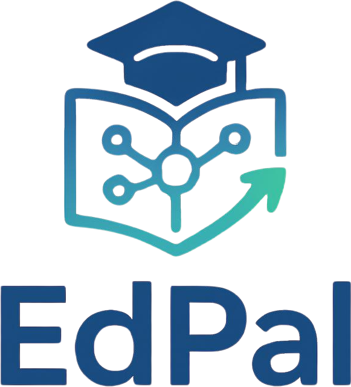

# **EdPal** Self-Evaluation and Careers Recommendation system

  

>EdPal is a self Evaluation and career recommendation system targeting learners age 12~18 as they try to make their career decisions. The system provides comprehensive assessments in bid to recommend the best careers that aligned with the learners' passions and education stregth. It is backed and contributed by various educationalists in Kenya.

---

## Project overview
### Apps Currently in the project

| Functionality/App | Brief Description |
|----------|------|
| core |   Shared abstractions  and functionalities across the other apps |
| assessment| Questionnaires (versioned), Questions, AnswerChoices, question banks,QuestionResponse, QuestionnaireAttempt — the write-hot tables,ScoringRule, AttemptScore  |
| careers | Career, Course, Institution, SubjectRequirement, CutoffCluster *Follows KUCCPS model* |
| accounts |  Custom User model, UserProfile, subject enrollment, career preferences with ranking |

## Technology Stack

| Language | Role |
|----------|------|
| Python 3.12+ | Primary development language for all layers |
| HTML | Mark up language |
| CSS | styling language |
| JS | DOM manipulation,fetch APIS, edge processing |

### Web framework and API

| Component | Technology |
|-----------|------------|
| Web server | Django 5.x + Django REST Framework |
| Async server | Uvicorn (ASGI) |
| Process manager | Gunicorn with Uvicorn workers |
| Real-time push | Django Channels (WebSocket) |

### Data storage

| Store | Purpose |
|-------|---------|
| PostgreSQL | Relational data: users, etc |
| Redis | Celery and Channels |

### Messaging

| Component | Role |
|-----------|------|
| RabbitMQ | Task queue backend for Celery background workers |

## License

GNU General Public License (GPL3)